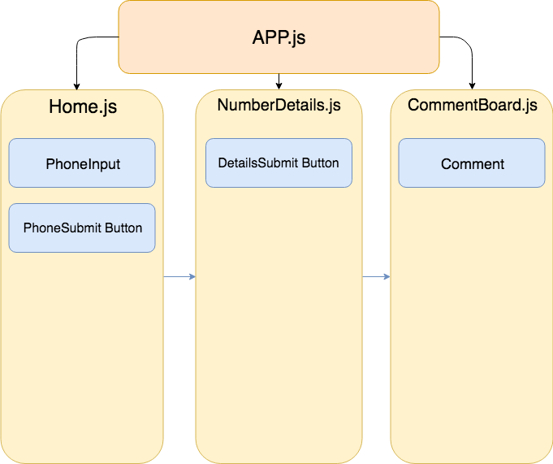

# Capstone Planning
**A capstone planning repo for Epicodus 07.20.18**

## By Bobby Martin

## Description
This repo is used for the sole purpose of laying out my personal capstone project. My capstone project is a React Native application that uses the Whitepages PRO Phone Reputation API. It displays data about a phone number and whether or not that number is some sort of scam or marketing call. It then displays all reported numbers on a single comment board.

## Component Tree

## Static App Repo
[Project Repo](https://github.com/bobbymart1n/npwd-react-native-capstone)

This project uses the _MIT License_  

&copy; **Bobby Martin** 2018
